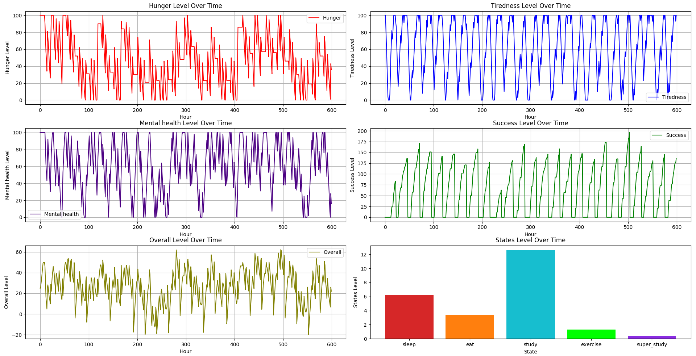

# DM_lab_finite_automata
The fourth laboratory on discrete mathematics about finite automata performed by Viktor Pakholok

# States of the finite automate
- Sleep
- Eat
- Exercise
- Study
- Super_study

# Stats
Also in this automate person, whose life will be simulated, have differnt stats such as:
- Hunger(Which actually shows satiety)
- Tiredness
- Mental_health
- Success

Theese parameters allow to simulate sb's life more accurately

# Random events
- if random.random() >= self.tiredness/100 + 0.7: 
Wakes up without breakfast to have more time to study
- if random.random() >= 0.8*(self.hunger+20)/80:
Eats one more time
- if random.random() >= 0.5:
Decides to do some exercises
- if 8 <= hour <= 20 and random.random() >= 0.8:
Becomes very productive
- if random.random() <= self.tiredness/80:
Stops to be so productive and continues to study as usual

# Photo of the diagram of the finite automata

# Images of simulation of life for different amount of days

1 Day

5 Days

10 Days

25 Days

100 Days

365 Days

# Credits
https://arpitbhayani.me/blogs/fsm-python

https://github.com/arpitbbhayani/fsm/blob/master/regex-1.ipynb
